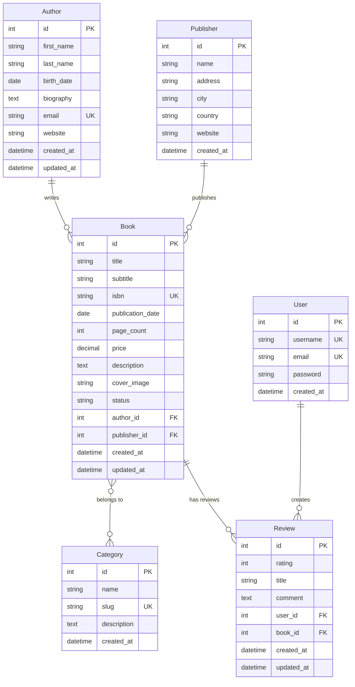
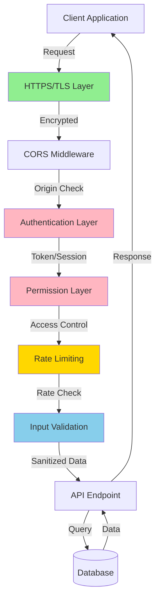
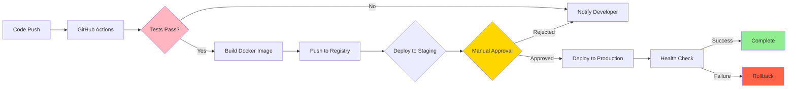

<div align="center">

# 📚 Django REST Framework - Professional Book API System

[](https://www.python.org/downloads/)
[](https://www.djangoproject.com/)
[](https://www.django-rest-framework.org/)
[](https://opensource.org/licenses/MIT)
[](https://github.com/psf/black)

### *A production-ready RESTful API for comprehensive book management*

[Features](#-feature-breakdown) • [Installation](#-quick-start--installation) • [Tech Stack](#-technology-stack-overview) • [Documentation](#-resources) • [License](#-license)

</div>

---

## 📜 Table of Contents

* [🚀 Quick Start & Installation](#-quick-start--installation)
* [🎯 Project Overview](#-project-overview)
* [👥 Team Roles and Responsibilities](#-team-roles-and-responsibilities)
* [🛠️ Technology Stack Overview](#️-technology-stack-overview)
* [🗄️ Database Design Overview](#️-database-design-overview)
* [✨ Feature Breakdown](#-feature-breakdown)
* [🔒 API Security Overview](#-api-security-overview)
* [🔄 CI/CD Pipeline Overview](#-cicd-pipeline-overview)
* [📚 Resources](#-resources)
* [📄 License](#-license)
* [👨‍💻 Created By](#-created-by)

---

## 🚀 Quick Start & Installation

### Prerequisites

Before you begin, ensure you have the following installed:
- **Python 3.11 or higher** - [Download Python](https://www.python.org/downloads/)
- **pip** - Python package manager (comes with Python)
- **Git** - Version control system
- **PostgreSQL** (optional, for production) - [Download PostgreSQL](https://www.postgresql.org/download/)

### Installation Steps

1️⃣ **Clone the repository**
```bash
git clone https://github.com/MachariaP/django-drf.git
cd django-drf
```

2️⃣ **Create and activate a virtual environment**
```bash
# On macOS/Linux
python3 -m venv venv
source venv/bin/activate

# On Windows
python -m venv venv
venv\Scripts\activate
```

3️⃣ **Install dependencies**
```bash
pip install -r requirements.txt
```

4️⃣ **Configure environment variables**
```bash
# Create a .env file in the project root
cp .env.example .env  # Or create manually
```

Add the following to your `.env` file:
```env
SECRET_KEY=your-secret-key-here
DEBUG=True
DATABASE_URL=sqlite:///db.sqlite3
ALLOWED_HOSTS=localhost,127.0.0.1
```

5️⃣ **Run database migrations**
```bash
cd django-api
python manage.py migrate
```

6️⃣ **Create a superuser**
```bash
python manage.py createsuperuser
```

7️⃣ **Start the development server**
```bash
python manage.py runserver
```

🎉 **Success!** Your API is now running at `http://localhost:8000/`

### 🔍 Explore the API

- **Browsable API**: http://localhost:8000/api/
- **Admin Panel**: http://localhost:8000/admin/
- **API Documentation (Swagger)**: http://localhost:8000/api/schema/swagger-ui/
- **API Documentation (ReDoc)**: http://localhost:8000/api/schema/redoc/

---

## 🎯 Project Overview

### 💡 Brief Description

This project is a comprehensive Django REST Framework (DRF) implementation that serves as a production-ready template for building modern, scalable RESTful APIs for book management systems. The API provides a complete backend solution for managing books, authors, publishers, categories, and user reviews with advanced features including authentication, permissions, filtering, pagination, and comprehensive documentation. Designed with best practices in mind, this project demonstrates enterprise-level API architecture suitable for e-commerce, library management systems, or any book-related digital platform.

The system leverages Django's powerful ORM and DRF's sophisticated serialization capabilities to deliver a robust, maintainable, and secure API that can handle complex data relationships while maintaining high performance and scalability. With built-in support for token-based authentication, automated API documentation via drf-spectacular, and extensive query optimization, this project serves both as a learning resource for developers and as a foundation for production deployments.

### 🎯 Project Goals

### 🎯 Project Goals

* 🏗️ **Build a Scalable RESTful API Architecture** - Implement a well-structured, maintainable API using Django REST Framework that can handle increasing traffic and data volume without performance degradation
* 📋 **Demonstrate Best Practices in API Design** - Showcase industry-standard patterns for URL routing, HTTP method usage, status codes, error handling, and response formatting
* 🗃️ **Implement Comprehensive Data Modeling** - Create normalized database schema with proper relationships (one-to-many, many-to-many) that ensures data integrity and efficient querying
* 🔐 **Enable Secure Access Control** - Provide robust authentication mechanisms (token-based, session-based) and fine-grained permissions to protect sensitive resources
* ⚡ **Optimize Database Performance** - Utilize query optimization techniques like select_related and prefetch_related to eliminate N+1 query problems and maintain fast response times
* 📖 **Facilitate API Discovery and Testing** - Offer automated OpenAPI/Swagger documentation for easy integration and a browsable API interface for interactive exploration
* 🔍 **Support Advanced Filtering and Search** - Implement powerful query capabilities including field filtering, full-text search, and flexible ordering to meet diverse client needs
* 🚀 **Establish Production-Ready Foundation** - Include configuration for deployment, static/media file handling, CORS support, and environment-based settings management

### 🔧 Key Tech Stack

### 🔧 Key Tech Stack

* 🐍 **Python 3.11+** - Modern programming language with strong type hints, async support, and rich ecosystem
* 🎯 **Django 5.2** - High-level web framework providing ORM, admin interface, authentication, and security features
* 🚀 **Django REST Framework 3.16** - Powerful toolkit for building Web APIs with serialization, viewsets, and authentication
* 🗄️ **PostgreSQL/SQLite** - Relational database systems for data persistence (PostgreSQL recommended for production)
* 📚 **drf-spectacular** - OpenAPI 3.0 schema generation for automated, interactive API documentation

<div align="right">

[⬆️ Back to top](#-django-rest-framework---professional-book-api-system)

</div>

---

## 👥 Team Roles and Responsibilities

## 👥 Team Roles and Responsibilities

| Role | Emoji | Key Responsibility |
|------|-------|-------------------|
| **Backend Developer** | 💻 | Design and implement API endpoints, business logic, serializers, and viewsets using Django and DRF. Write unit and integration tests to ensure code quality. Optimize database queries and implement caching strategies for performance. |
| **Database Administrator** | 🗄️ | Design and maintain database schema, create and manage migrations, optimize queries through indexing and query analysis. Monitor database performance, implement backup strategies, and ensure data integrity and security. |
| **DevOps Engineer** | 🔧 | Set up and maintain CI/CD pipelines for automated testing and deployment. Manage containerization with Docker, orchestrate with Kubernetes, configure cloud infrastructure, monitor system health, and ensure high availability and scalability. |
| **QA Engineer** | 🧪 | Develop comprehensive test plans, write automated API tests, perform manual testing for edge cases. Conduct load testing to ensure performance under stress. Document bugs and verify fixes. Maintain test coverage above 80%. |
| **Frontend Developer** | 🎨 | Integrate with API endpoints from web and mobile applications. Handle authentication flows, implement error handling, manage state with API data. Provide feedback on API design from consumer perspective. |
| **Security Specialist** | 🔒 | Implement and audit authentication and authorization mechanisms. Conduct security reviews and penetration testing. Ensure compliance with security best practices including HTTPS, input validation, rate limiting, and protection against common vulnerabilities (SQL injection, XSS, CSRF). |
| **Technical Writer** | 📝 | Create and maintain comprehensive API documentation including endpoint descriptions, request/response examples, authentication guides. Write setup and deployment guides. Keep README files up-to-date with project changes. |
| **Project Manager** | 📊 | Coordinate team efforts, prioritize feature development, manage sprint planning and releases. Communicate with stakeholders, track project milestones, identify and mitigate risks, ensure project goals align with business objectives. |

<div align="right">

[⬆️ Back to top](#-django-rest-framework---professional-book-api-system)

</div>

---

## 🛠️ Technology Stack Overview

## 🛠️ Technology Stack Overview

<details>
<summary><b>📦 Core Technologies (Click to expand)</b></summary>

| Technology | Purpose in the Project |
|------------|----------------------|
| **Python 3.11+** | Core programming language providing modern features like type hints, match statements, and improved performance. Serves as the foundation for all backend logic and business rules. |
| **Django 5.2** | Full-featured web framework offering ORM for database interactions, built-in admin interface for data management, user authentication system, URL routing, template engine, and comprehensive security features out of the box. |
| **Django REST Framework 3.16** | Specialized toolkit extending Django for building RESTful APIs. Provides serializers for data validation and transformation, viewsets for reducing boilerplate code, built-in authentication schemes, permission classes, browsable API interface, and pagination. |

</details>

<details>
<summary><b>🗄️ Database Technologies (Click to expand)</b></summary>

| Technology | Purpose in the Project |
|------------|----------------------|
| **PostgreSQL** | Production-grade relational database management system offering ACID compliance, advanced indexing, full-text search, JSON support, and excellent scalability for handling large datasets and concurrent connections. |
| **SQLite** | Lightweight embedded database perfect for development and testing environments. Requires no separate server process, simplifying local development setup. |

</details>

<details>
<summary><b>📚 API Documentation & Utilities (Click to expand)</b></summary>

| Technology | Purpose in the Project |
|------------|----------------------|
| **drf-spectacular** | Automated OpenAPI 3.0 schema generation tool that creates interactive API documentation (Swagger UI and ReDoc) directly from code, ensuring documentation stays synchronized with implementation. |
| **django-cors-headers** | Middleware for handling Cross-Origin Resource Sharing (CORS) headers, enabling frontend applications hosted on different domains to securely communicate with the API. |
| **django-filter** | Advanced filtering backend that allows API consumers to filter querysets dynamically using URL query parameters, supporting exact matches, ranges, lookups, and complex AND/OR conditions. |
| **Pillow** | Python Imaging Library for handling image uploads, processing, and transformation. Used for book cover images with support for multiple formats (JPEG, PNG, GIF, etc.). |
| **psycopg2-binary** | PostgreSQL adapter for Python, enabling Django's ORM to communicate with PostgreSQL databases efficiently. Binary distribution simplifies installation across platforms. |
| **python-dotenv** | Environment variable management tool for loading configuration from .env files, keeping sensitive credentials and environment-specific settings out of source code. |

</details>

<details>
<summary><b>🚀 Deployment & Infrastructure (Click to expand)</b></summary>

| Technology | Purpose in the Project |
|------------|----------------------|
| **Git** | Version control system for tracking code changes, collaborating with team members, managing branches for features and releases, and maintaining project history. |
| **Docker** | Containerization platform ensuring consistent development and production environments. Packages application with all dependencies, eliminating "works on my machine" issues. |
| **Gunicorn** | Python WSGI HTTP server for running Django in production. Handles multiple concurrent requests efficiently through worker processes, suitable for high-traffic deployments. |
| **Nginx** | High-performance reverse proxy and web server for handling SSL termination, serving static files, load balancing across application servers, and protecting against common attacks. |
| **Redis** | In-memory data structure store used for caching frequently accessed data (reducing database load), session management, and as a message broker for Celery task queues. |
| **Celery** | Distributed task queue for handling asynchronous and scheduled tasks like sending emails, processing large datasets, generating reports, and any long-running operations that shouldn't block API responses. |

</details>

<div align="right">

[⬆️ Back to top](#-django-rest-framework---professional-book-api-system)

</div>

---

## 🗄️ Database Design Overview

## 🗄️ Database Design Overview

### 📊 Entity Relationship Diagram



### 📋 Key Entities

### 📋 Key Entities

* 👤 **Author** - Stores author information including first name, last name, birth date, biography, email (unique), website, and audit timestamps (created_at, updated_at). Includes a computed full_name property for convenient access.

* 📚 **Category** - Represents book categorization (e.g., Fiction, Science, Technology) with name, description, URL-friendly slug for routing, and creation timestamp. Enables filtering and organization of books by topic or genre.

* 🏢 **Publisher** - Contains publishing company details such as name, physical address, city, country, website URL, and creation timestamp. Tracks which organizations publish which books.

* 📖 **Book** - Core entity storing comprehensive book metadata: title, subtitle, ISBN (unique 13-digit identifier), publication date, page count, price (decimal for accuracy), description, cover image path, and availability status (available/out_of_stock/coming_soon). Includes database indexes on title and ISBN for fast lookups.

* ⭐ **Review** - User-generated book reviews containing a rating (1-5 stars validated), review title, detailed comment text, and timestamps. Enforces unique_together constraint ensuring each user can only review a book once, preventing duplicate reviews.

* 👥 **User** - Built-in Django authentication model managing user accounts, passwords, permissions, and profile information. Referenced by reviews to track authorship and enable personalization features.

### 🔗 Relationships

### 🔗 Relationships

* **Author ↔ Book (One-to-Many)**: A single Author can write many Books, but each Book has exactly one primary Author. Implemented using ForeignKey from Book to Author with related_name='books', allowing reverse queries like `author.books.all()`. Uses CASCADE deletion - if an author is removed, all their books are also deleted to maintain referential integrity.

* **Category ↔ Book (Many-to-Many)**: A Book can belong to multiple Categories (e.g., a programming book might be in both "Technology" and "Education"), and each Category contains multiple Books. Implemented with ManyToManyField creating an intermediary junction table. This flexible relationship enables sophisticated filtering like "show all Science Fiction books" while allowing books to exist in multiple taxonomies.

* **Publisher ↔ Book (One-to-Many, Optional)**: A Publisher can publish many Books, but each Book can have zero or one Publisher. Uses ForeignKey with on_delete=SET_NULL allowing books to exist without a publisher (self-published works). The null=True, blank=True configuration makes publisher optional in forms and APIs.

* **User ↔ Review (One-to-Many)**: A User can write many Reviews, but each Review belongs to one User. ForeignKey relationship with related_name='reviews' enables querying all reviews by a specific user. CASCADE deletion ensures reviews are removed if the user account is deleted.

* **Book ↔ Review (One-to-Many)**: A Book can have many Reviews from different users, but each Review is about one Book. Combined with the unique_together constraint ['book', 'user'], this ensures data integrity while allowing multiple perspectives on each book. CASCADE deletion removes all reviews when a book is deleted.

<div align="right">

[⬆️ Back to top](#-django-rest-framework---professional-book-api-system)

</div>

---

## ✨ Feature Breakdown

## ✨ Feature Breakdown

### 🎯 Core Features

* 🌐 **RESTful API Architecture** - Implements industry-standard REST principles with proper HTTP verb usage (GET for retrieval, POST for creation, PUT/PATCH for updates, DELETE for removal) and meaningful status codes (200 OK, 201 Created, 400 Bad Request, 404 Not Found). Resources are accessed via clean, hierarchical URLs following the pattern `/api/{resource}/` and `/api/{resource}/{id}/`, making the API intuitive and self-documenting.

* 🔄 **Advanced Model Serialization** - Converts complex Django model instances with nested relationships into JSON representations suitable for API responses, and vice versa for incoming data. Includes custom serializer methods for computed fields (like average ratings, book counts), read-only fields for database-generated values, and write-only fields for sensitive operations. Automatic validation ensures data integrity before database commits.

* 📦 **ViewSets and URL Routing** - Dramatically reduces boilerplate code by combining list, create, retrieve, update, and destroy views into single ViewSet classes. DefaultRouter automatically generates URL patterns for all standard operations plus custom actions decorated with @action. This approach provides complete CRUD functionality with minimal code while maintaining flexibility for custom endpoints.

### 🎨 User Interface & Testing

* 🌈 **Interactive Browsable API** - DRF's built-in web interface allows developers to explore and test API endpoints directly from a browser without external tools. Features include syntax-highlighted JSON responses, HTML forms for POST/PUT requests, authentication integration, and helpful error messages. Invaluable for development, debugging, and API discovery.

### 🔐 Authentication & Authorization

* 🔑 **Multi-Scheme Authentication** - Supports both TokenAuthentication for stateless API access (ideal for mobile apps and SPAs) and SessionAuthentication for browser-based clients. Token auth provides a secure, scalable authentication method where clients include a bearer token in request headers. Session auth leverages Django's built-in session framework for traditional web applications.

* 🛡️ **Granular Permission System** - Fine-grained access control through reusable permission classes. IsAuthenticatedOrReadOnly allows public read access but requires authentication for modifications. Custom permissions can enforce complex business rules like "users can only edit their own reviews" or "only staff can delete books". Permission logic is centralized and easy to test.

### ✅ Data Validation & Quality

* ✔️ **Comprehensive Data Validation** - Multi-layer validation ensures data quality: field-level validators (e.g., rating must be 1-5, price >= 0), model-level constraints (unique ISBN, unique_together for user-book reviews), and custom serializer validation methods for complex business rules. Clear, structured error messages guide API consumers to provide valid data.

### 🔍 Search & Filter

* 🎯 **Dynamic Filtering and Search** - django-filter integration enables powerful querying via URL parameters without custom code. Filter books by status, author, category, or price range using intuitive syntax like `?status=available&author=1`. SearchFilter provides full-text search across multiple fields simultaneously. OrderingFilter allows result sorting by any field, ascending or descending.

* 📄 **Intelligent Pagination** - Handles large datasets efficiently by breaking responses into manageable pages. Default configuration returns 10 items per page with navigation metadata including total count, next/previous page URLs, and current page number. Prevents memory exhaustion and improves API response times for queries returning thousands of records.

### 📚 Documentation

* 📖 **Automated API Documentation** - drf-spectacular generates comprehensive OpenAPI 3.0 schemas automatically from code, ensuring documentation stays synchronized with implementation. Provides interactive Swagger UI for testing endpoints with real requests and ReDoc for beautiful, readable documentation. No manual documentation maintenance required - docstrings and type hints drive the output.

### ⚡ Performance Optimization

* 🚀 **Optimized Database Queries** - Strategic use of select_related() for ForeignKey relationships and prefetch_related() for ManyToMany fields eliminates N+1 query problems. A single optimized query can replace hundreds of inefficient queries, reducing database load and API response times from seconds to milliseconds. Essential for production performance at scale.

* 📡 **Flexible Content Negotiation** - Supports multiple response formats (JSON, browsable HTML) based on client Accept headers. JSON is default for API consumers, while browsable HTML aids development and testing. Framework can be extended to support XML, CSV, or custom formats. Request/response format is transparent to view logic.

<div align="right">

[⬆️ Back to top](#-django-rest-framework---professional-book-api-system)

</div>

---

## 🔒 API Security Overview

## 🔒 API Security Overview

### 🛡️ Security Architecture



### 🔐 Authentication Mechanisms

### 🔐 Authentication Mechanisms

**🎫 Token-Based Authentication** is implemented using DRF's TokenAuthentication, providing stateless, scalable API access ideal for mobile applications and single-page web apps. Upon successful login, users receive a unique authentication token that must be included in the Authorization header (`Authorization: Token <token>`) of subsequent requests. Tokens are stored securely in the database and validated on each request, enabling horizontal scaling across multiple servers without session sharing complexities.

**🍪 Session-Based Authentication** leverages Django's robust session framework for traditional web applications where maintaining state is beneficial. After login, Django creates an encrypted session cookie stored in the client's browser, automatically included in subsequent requests. The server validates the session against database-stored session data, supporting features like CSRF protection and seamless integration with Django's admin interface.

### 🛡️ Authorization and Access Control

**✅ Permission Classes** provide fine-grained authorization by defining who can perform which operations on which resources. The IsAuthenticatedOrReadOnly permission allows anonymous users to read data (GET requests) but requires authentication for modifications (POST, PUT, PATCH, DELETE), balancing open access with data protection. IsAuthenticated restricts all access to authenticated users only, while IsAdminUser limits operations to staff members.

**🎯 Object-Level Permissions** enable granular control based on object ownership or attributes. For example, ReviewOwnerPermission ensures users can only edit or delete their own reviews, even if authenticated. These permissions are checked at the ViewSet level and can implement complex business logic like "authors can edit their own books" or "premium users have elevated access limits." This prevents unauthorized modifications while maintaining API flexibility.

### ✔️ Input Validation and Sanitization

**📝 Serializer Validation** is the first line of defense against malicious or malformed data. Every incoming request passes through serializers that enforce field types (integers, strings, emails), value constraints (rating 1-5, price >= 0), string lengths (max 200 characters), and required/optional field rules. Invalid data is rejected with detailed error messages before reaching business logic or database, preventing injection attacks and data corruption.

**🔧 Custom Validation Methods** allow implementation of complex business rules and cross-field validation. For example, ensuring email uniqueness across authors, validating ISBN format (13 digits), or confirming publication dates are not in the future. Django's ORM automatically escapes SQL queries, preventing SQL injection vulnerabilities. All user-supplied data is sanitized before storage or display.

### ⏱️ Rate Limiting and Throttling

**🚦 Throttling Policies** protect the API from abuse, denial-of-service attacks, and excessive resource consumption by limiting request rates per user or client. AnonRateThrottle restricts anonymous users to a lower threshold (e.g., 100 requests/day), preventing automated scraping or attacks. UserRateThrottle allows authenticated users higher limits (e.g., 1000 requests/day), encouraging authentication while preventing individual user abuse.

When limits are exceeded, the API returns a 429 Too Many Requests status with a Retry-After header indicating when the client can resume requests. This graduated approach ensures fair resource allocation, maintains API performance for all users, and provides early warning of suspicious activity or misbehaving clients that can be investigated or blocked.

### 🔐 Data Encryption in Transit

**🔒 HTTPS/TLS Enforcement** in production environments encrypts all data transmitted between clients and servers using industry-standard SSL/TLS protocols. This protects sensitive information (passwords, authentication tokens, personal data) from interception during transmission over untrusted networks. The SECURE_SSL_REDIRECT setting automatically redirects HTTP requests to HTTPS, and HSTS headers instruct browsers to always use secure connections, preventing downgrade attacks.

### 🌐 Cross-Origin Resource Sharing (CORS)

**🔀 CORS Configuration** via django-cors-headers controls which external domains can access the API, preventing unauthorized cross-origin requests from malicious websites. CORS_ALLOWED_ORIGINS explicitly lists trusted frontend domains (e.g., https://app.example.com), rejecting requests from unknown sources. This mechanism protects user data while enabling legitimate SPAs and mobile apps to communicate with the API, maintaining both security and functionality.

### 🛡️ Defense Against Common Vulnerabilities

**💉 SQL Injection Prevention** is achieved through Django's ORM which automatically parameterizes all database queries, treating user input as data rather than executable SQL code. The ORM escapes special characters and uses prepared statements, eliminating SQL injection risks without requiring manual sanitization. Direct SQL queries are discouraged and when necessary must use parameterized queries.

**⚠️ Cross-Site Scripting (XSS) Protection** is enforced through proper content-type headers, output encoding, and Django's template auto-escaping. The browsable API properly escapes HTML in responses, preventing malicious JavaScript injection. SECURE_CONTENT_TYPE_NOSNIFF prevents browsers from MIME-sniffing responses, and X-XSS-Protection header enables browser-side XSS filtering as an additional layer of defense.

**🔐 CSRF Protection** for session-based authentication requires CSRF tokens in state-changing requests (POST, PUT, DELETE), preventing malicious websites from tricking users into performing unwanted actions. Django generates unique CSRF tokens per session and validates them on each mutating request. REST clients using token authentication bypass CSRF checks as token theft would require account compromise.

<div align="right">

[⬆️ Back to top](#-django-rest-framework---professional-book-api-system)

</div>

---

## 🔄 CI/CD Pipeline Overview

## 🔄 CI/CD Pipeline Overview

### 🔁 Pipeline Flow



### 📋 Pipeline Overview

### 📋 Pipeline Overview

Continuous Integration and Continuous Deployment (CI/CD) represents a modern software development practice that automates the testing, building, and deployment of code changes, enabling teams to deliver updates more frequently with higher confidence and lower risk. For this Django REST Framework project, CI/CD eliminates manual deployment errors, catches bugs early through automated testing, and ensures consistent builds across all environments from development to production.

### 🔄 Continuous Integration

The **Continuous Integration** component triggers automatically whenever code is pushed to the repository or a pull request is created. It immediately spins up a clean test environment, installs project dependencies, and runs the comprehensive test suite including unit tests, integration tests, and code quality checks using tools like flake8 and black. Database migrations are validated to ensure they can be applied without conflicts. If any test fails or code quality issues are detected, the pipeline halts and notifies developers before problematic code can be merged, maintaining high code quality standards and preventing regression bugs.

### 🚀 Continuous Deployment

The **Continuous Deployment** workflow activates when code is merged to the main branch, building a Docker container image with the application, all dependencies, and configuration. This image is tagged with the git commit SHA for traceability and pushed to a container registry (Docker Hub, AWS ECR, or Google Container Registry). The pipeline then updates the Kubernetes cluster or cloud platform with the new image, performing a rolling update that gradually replaces old containers with new ones while maintaining zero downtime - users experience no service interruption.

### ⚙️ Automation Platform

**GitHub Actions** serves as the primary automation platform for this project, offering tight integration with the repository, secret management for API keys and credentials, and matrix builds for testing across multiple Python versions. The workflow includes parallel execution of linting and security scans to minimize total pipeline time, caching of pip packages and Docker layers for faster builds, and deployment to staging environments for final validation before production release.

### 🌍 Environment Management

**Environment Management** ensures different configurations for development, staging, and production without code changes. Environment variables control database connections (SQLite for dev, PostgreSQL for production), debug mode (enabled in dev, disabled in production), secret keys, external API credentials (Stripe, SendGrid, AWS), and feature flags. Secrets are encrypted and injected at runtime rather than committed to source code, maintaining security while enabling automated deployments.

### ✅ Quality Gates

**Quality Gates** enforce standards before deployment: test coverage must exceed 80%, security scans must find no high-severity vulnerabilities, code must pass linting without errors, and database migrations must be reversible. Manual approval gates can be configured for production deployments, requiring human verification before changes affect live users. If any stage fails, the pipeline stops and rolls back automatically, maintaining system stability and allowing quick recovery from issues.

### 📊 Monitoring & Notifications

The pipeline generates comprehensive deployment logs, tracks metrics like deployment frequency and failure rate, and integrates with monitoring tools to verify successful deployment through health check endpoints. Notifications are sent to team channels (Slack, email) for deployment status, enabling rapid response to failures while maintaining team awareness of system changes. This automated approach transforms deployment from a risky, manual process into a reliable, repeatable operation that can occur multiple times daily with confidence.

<div align="right">

[⬆️ Back to top](#-django-rest-framework---professional-book-api-system)

</div>

---

## 📚 Resources

## 📚 Resources

### 📖 Official Documentation

| Resource | Description |
|----------|-------------|
| 🌐 [Django Documentation](https://docs.djangoproject.com/) | Complete Django framework documentation covering models, views, templates, ORM, authentication, and deployment |
| 🚀 [Django REST Framework Documentation](https://www.django-rest-framework.org/) | Comprehensive DRF documentation with guides on serializers, viewsets, authentication, permissions, and best practices |
| 📊 [drf-spectacular Documentation](https://drf-spectacular.readthedocs.io/) | OpenAPI schema generation and API documentation tools |
| 🗄️ [PostgreSQL Documentation](https://www.postgresql.org/docs/) | Official PostgreSQL documentation for database administration and SQL reference |

### 🎓 Learning Resources

| Resource | Description |
|----------|-------------|
| 📘 [DRF Tutorial - Quickstart](https://www.django-rest-framework.org/tutorial/quickstart/) | Official beginner-friendly tutorial for building your first API |
| 🔧 [Creating REST APIs with Django REST Framework](https://www.django-rest-framework.org/tutorial/1-serialization/) | Step-by-step serialization and API development guide |
| 🔑 [Token Based Authentication in Django](https://www.django-rest-framework.org/api-guide/authentication/#tokenauthentication) | Implementation guide for stateless authentication |
| 🍪 [Session Based Authentication](https://www.django-rest-framework.org/api-guide/authentication/#sessionauthentication) | Guide for traditional session-based auth |
| 📋 [REST API Best Practices](https://restfulapi.net/) | Industry guidelines for designing RESTful APIs with proper resource naming and HTTP methods |

### 📚 Books and In-Depth Resources

* 📖 **Two Scoops of Django** - Best practices for Django development with real-world patterns and anti-patterns
* 🚀 **Django for APIs** - Building web APIs with Python and Django by William Vincent
* 🐍 **Real Python Tutorials** - Comprehensive Django and DRF tutorials with practical examples

### 🛠️ Tools and Additional Libraries

| Tool | Description |
|------|-------------|
| 🐍 [Python Type Hints](https://docs.python.org/3/library/typing.html) | Type annotation documentation for improved code quality |
| 🐳 [Docker Documentation](https://docs.docker.com/) | Containerization guide for consistent deployments |
| 🔴 [Redis Documentation](https://redis.io/documentation) | In-memory caching and session store documentation |
| 🌿 [Celery Documentation](https://docs.celeryproject.org/) | Distributed task queue for background processing |

### 💬 Community and Support

| Platform | Purpose |
|----------|---------|
| 💭 [Django Forum](https://forum.djangoproject.com/) | Official Django community forum for questions and discussions |
| 🐛 [DRF GitHub Issues](https://github.com/encode/django-rest-framework/issues) | Report bugs or request features |
| ❓ [Stack Overflow](https://stackoverflow.com/questions/tagged/django-rest-framework) | Q&A for specific technical problems |
| 🎨 [Classy DRF](http://www.cdrf.co/) | Visual reference for all DRF class-based views and their methods |

<div align="right">

[⬆️ Back to top](#-django-rest-framework---professional-book-api-system)

</div>

---

## 📄 License

## 📄 License

This project is licensed under the **MIT License**.

```
MIT License

Copyright (c) 2024 Phinehas Macharia

Permission is hereby granted, free of charge, to any person obtaining a copy
of this software and associated documentation files (the "Software"), to deal
in the Software without restriction, including without limitation the rights
to use, copy, modify, merge, publish, distribute, sublicense, and/or sell
copies of the Software, and to permit persons to whom the Software is
furnished to do so, subject to the following conditions:

The above copyright notice and this permission notice shall be included in all
copies or substantial portions of the Software.

THE SOFTWARE IS PROVIDED "AS IS", WITHOUT WARRANTY OF ANY KIND, EXPRESS OR
IMPLIED, INCLUDING BUT NOT LIMITED TO THE WARRANTIES OF MERCHANTABILITY,
FITNESS FOR A PARTICULAR PURPOSE AND NONINFRINGEMENT. IN NO EVENT SHALL THE
AUTHORS OR COPYRIGHT HOLDERS BE LIABLE FOR ANY CLAIM, DAMAGES OR OTHER
LIABILITY, WHETHER IN AN ACTION OF CONTRACT, TORT OR OTHERWISE, ARISING FROM,
OUT OF OR IN CONNECTION WITH THE SOFTWARE OR THE USE OR OTHER DEALINGS IN THE
SOFTWARE.
```

> 💡 **What this means:** You're free to use, modify, and distribute this project commercially or non-commercially. Just include the license and copyright notice!

<div align="right">

[⬆️ Back to top](#-django-rest-framework---professional-book-api-system)

</div>

---

## 👨‍💻 Created By

## 👨‍💻 Created By

<div align="center">

### **Phinehas Macharia**

*Full Stack Developer | API Architect | Django Enthusiast*

This comprehensive Django REST Framework implementation was designed and developed to showcase enterprise-level API development practices, combining robust architecture with clear documentation and production-ready features. The project serves both as a learning resource for developers entering the world of RESTful APIs and as a solid foundation for building scalable web services.

---

### 🤝 Contributing

Contributions, issues, and feature requests are welcome! Feel free to check the [issues page](https://github.com/MachariaP/django-drf/issues).

1. Fork the Project
2. Create your Feature Branch (`git checkout -b feature/AmazingFeature`)
3. Commit your Changes (`git commit -m 'Add some AmazingFeature'`)
4. Push to the Branch (`git push origin feature/AmazingFeature`)
5. Open a Pull Request

### ⭐ Show your support

Give a ⭐️ if this project helped you!

---

### 📞 Contact

For questions, contributions, or collaboration opportunities:

* 📧 **Email**: Open an issue on GitHub
* 💼 **GitHub**: [@MachariaP](https://github.com/MachariaP)
* 🌐 **Repository**: [django-drf](https://github.com/MachariaP/django-drf)

</div>

---

<div align="center">

**Made with ❤️ by Phinehas Macharia**

*Building robust APIs, one endpoint at a time* 🚀

[⬆️ Back to top](#-django-rest-framework---professional-book-api-system)

</div>
